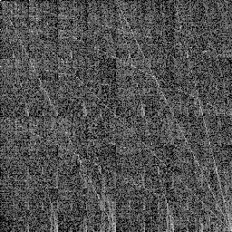
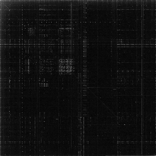
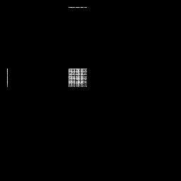
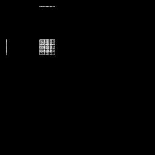
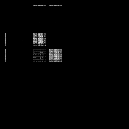

# Binary Visualizer
This idea was built after taking inspiration from a Tsoding stream on Data Reverse Engineering.

I have tried to keep the dependency on external libraries as low as possible. This can be done in a lot less code (or more) by using numpy and matplotlib, but for purposes of learning and understanding how this works, i felt it would be better to reinvent the wheel.

### PNG Image
 

### Executable x86_64
 

### Text (Lowercase, Uppercase, Mixedcase)
 
 
 
